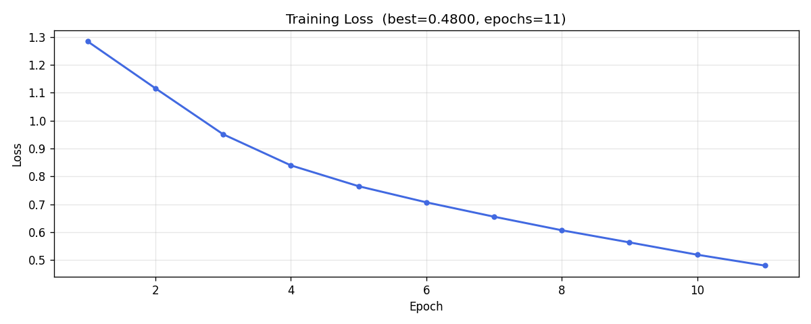
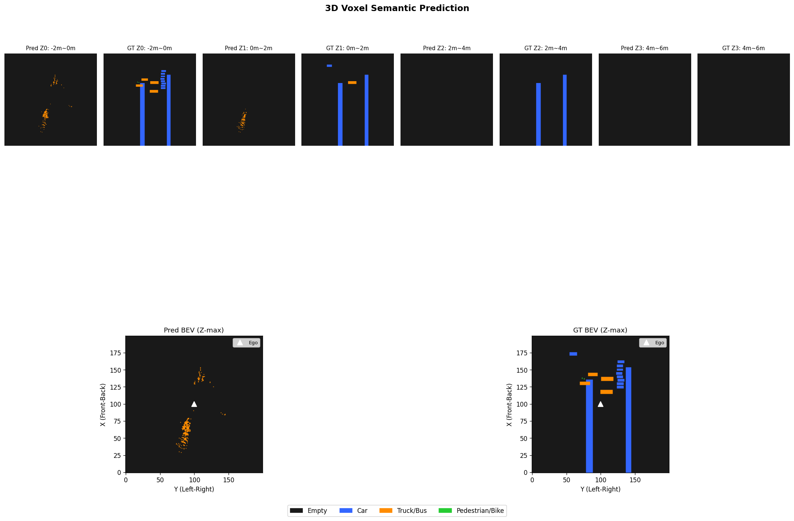
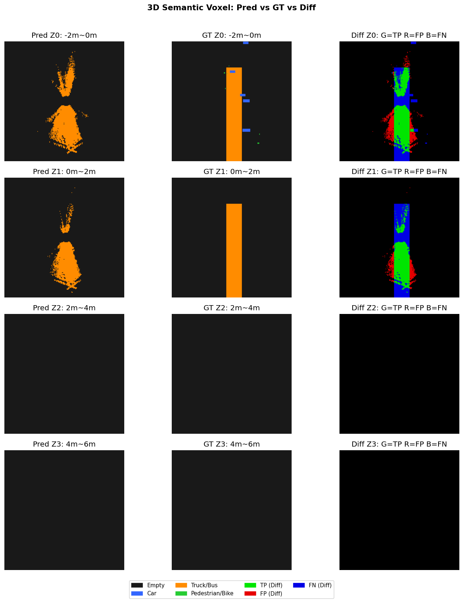

# BEV 3D Semantic Occupancy — LSS (Lift-Splat-Shoot)

자율주행 환경에서 **6대의 카메라 이미지**만으로 **Bird's Eye View(BEV) 3D 점유 공간**을 예측하는 딥러닝 프로젝트입니다.

---

## 개요

| 항목 | 내용 |
|------|------|
| 방법론 | LSS (Lift-Splat-Shoot) |
| 백본 | ResNet18 (ImageNet pretrained) |
| 데이터셋 | NuScenes mini (v1.0-mini, 404 samples) |
| 입력 | 6-camera surround images (1056×384) |
| 출력 | 3D Voxel Grid (200×200×4 Z-layers, 100m×100m×8m) |
| 클래스 | Empty / Car / Truck·Bus / Pedestrian·Bike |

---

## 아키텍처

```
6× Camera Images (1056×384)
        │
        ▼
  [CamEncoder] ResNet18 → Depth(D=41) + Feature(C=64)
        │
        ▼
  [Lift] Frustum Points: 픽셀 → 3D 공간 (카메라 내/외부 파라미터 사용)
        │
        ▼
  [Splat] Z-aware VoxelPooling: 3D 점 → BEV Grid (nz*C=256 채널)
        │
        ▼
  [BEV Compressor] Conv2D(256→256) + BN + ReLU
        │
        ▼
  [Decoder] Conv2D → (B, 4classes, 4Z, 200, 200)
```

### 핵심 개선 사항 (vs. 기본 LSS)

| 개선 | 내용 |
|------|------|
| **Z-aware VoxelPooling** | 기존엔 Z 좌표가 무시됨 → 높이층별 특징 보존 (치명적 버그 수정) |
| **GT 좌표계 수정** | LIDAR 센서 프레임 박스를 Ego 프레임으로 올바르게 변환 (핵심 버그 수정) |
| **Focal Loss** | γ=2, 클래스 가중치 [0.1, 50, 40, 80]으로 극단적 클래스 불균형 대응 |
| 3D Semantic 출력 | 4개 Z층 × 4 클래스 동시 예측 |
| Augmentation 분리 | 학습 시만 ColorJitter/RandomGrayscale 적용 |
| 클래스별 mIoU | Empty 포함 4-class 및 전경 3-class 별도 리포트 |
| 시맨틱 시각화 | 클래스별 색상 BEV 맵 + Z층별 분리 시각화 |

---

## 파일 구조

```
code2/
├── train.py              # 학습 (LSS 모델 정의 + 학습 루프)
├── model.py              # CamEncoder (ResNet18 기반)
├── splat.py              # Z-aware VoxelPooling
├── nuscenes_dataset.py   # NuScenes 데이터 로더
├── evaluate_all_3d.py    # 클래스별 3D mIoU 평가
├── visualize_3d.py       # 시맨틱 BEV 시각화 (PNG 저장)
├── check_result_3d.py    # Pred vs GT vs Diff 비교 (PNG 저장)
├── make_video.py         # 시맨틱 컬러 주행 영상 생성
├── save_loss_curve.py    # CSV 로그에서 손실 그래프 재생성
├── run_pipeline.py       # 평가 + 시각화 일괄 실행
└── results/              # 학습 로그, 평가 결과, 시각화 이미지
    ├── train_log.csv
    ├── train_info.json
    ├── loss_curve.png
    ├── eval_results.json
    ├── semantic_bev_3d.png
    └── check_result_3d.png
```

---

## 실행 방법

> conda 환경: `ai_project` (Python 3.10, PyTorch + CUDA)

### 1. 학습

```bash
cd code2
python train.py
# 결과: best_semantic_mini_model.pth, results/loss_curve.png
```

### 2. 평가 (클래스별 mIoU)

```bash
python evaluate_all_3d.py
# 결과: results/eval_results.json
```

### 3. 시각화

```bash
python visualize_3d.py    # 시맨틱 BEV 맵 → results/semantic_bev_3d.png
python check_result_3d.py # Pred vs GT → results/check_result_3d.png
python make_video.py      # 주행 영상 → driving_demo2.mp4
```

---

## 학습 설정

| 파라미터 | 값 |
|----------|-----|
| Batch Size | 4 (Gradient Accumulation 2 → effective 8) |
| Learning Rate | 3e-4 (OneCycleLR) |
| Optimizer | AdamW (weight_decay=1e-4) |
| Loss | **FocalLoss** (γ=2, weights: [0.1, 50, 40, 80]) |
| Early Stopping | patience=15 |
| Mixed Precision | torch.amp (CUDA) |

---

## 결과 (95 Epoch 학습, 버그 수정 후)

> GPU: NVIDIA GeForce RTX 5070 Laptop | Dataset: NuScenes mini (404 samples)

### 손실 곡선



| Epoch | Loss |
|-------|------|
| 1 | 0.8493 |
| 10 | 0.3865 |
| 30 | 0.1363 |
| 60 | 0.0994 |
| **80 (Best)** | **0.0747** |
| 95 (Early Stop) | 0.0809 |

> 이전 학습(버그 있음): Best Loss 0.6553 (7 epoch) → 수정 후: **0.0747 (95 epoch)** — 8.8배 개선

### 클래스별 3D mIoU

| 클래스 | IoU | 비고 |
|--------|-----|------|
| Empty (배경) | 29.32% | Focal Loss로 전경 강조 |
| **Car** | **2.13%** | 이전: 0.00% → 감지 성공 |
| **Truck/Bus** | **1.31%** | 유지 |
| **Pedestrian/Bike** | **1.00%** | 이전: 0.00% → 감지 성공 |
| **전체 mIoU (4 classes)** | **8.44%** | |
| **전경 mIoU (Empty 제외)** | **1.48%** | 이전 0.59% 대비 **2.5배 향상** |

> **핵심 버그 2가지 수정 결과**: Car·Pedestrian 클래스 감지 성공 (이전엔 0%)
> - Bug 1: GT 좌표계 오류 (LIDAR 프레임 → Ego 프레임 변환 누락)
> - Bug 2: 클래스 불균형 미대응 (CrossEntropy → FocalLoss + 강화 가중치)

### BEV 시각화





---

## 클래스 색상 범례

| 색상 | 클래스 |
|------|--------|
| 회색 | Empty (배경) |
| 파랑 | Car |
| 주황 | Truck / Bus |
| 초록 | Pedestrian / Bike |

---

## 참고 문헌

- [Lift, Splat, Shoot (ECCV 2020)](https://arxiv.org/abs/2008.05711)
- [NuScenes Dataset](https://www.nuscenes.org/)
