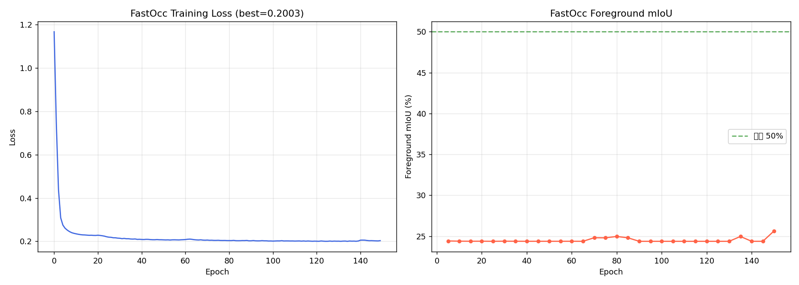

# 3D Semantic Occupancy 자율주행 시스템

**PC 기반 실시간 3D Semantic Occupancy 생성 → 장애물 회피 경로 계획 → STM32 CAN 통신 → 자율주행**

6개 서라운드 카메라 이미지로 3D 의미론적 점유 공간을 예측하고,
A* 경로계획 결과를 STM32 보드에 CAN 통신으로 전달하는 완전한 자율주행 파이프라인입니다.

---

## 버전 이력

| 버전 | 디렉터리 | 모델 | 특징 |
|------|----------|------|------|
| v1 | `code2/` | LSS v1 (ResNet-18) | 초기 구현 |
| v2 | `code2/` | LSS v2 (EfficientNet-B0) | SE-Attention, Dynamic FocalLoss |
| **v3** | `code3/` | **FastOcc** (EfficientNet-B2) | **LSS 탈피 — 기하학적 복셀 샘플링 + Channel-to-Height, 6-Cam 360°** |

---

## 시스템 아키텍처 (v3 — FastOcc 6-Camera Surround)

```
┌─────────────────────────────────────────────────────────────────┐
│                         PC (GPU 추론)                            │
│                                                                 │
│  FL / F / FR / BL / B / BR  (6× 서라운드 카메라 256×704)         │
│          │                                                       │
│          ▼  [공유 인코더: 배치 처리]                               │
│  [EfficientNet-B2 + FPN]  → 128ch feature × 6                  │
│          │                                                       │
│          ▼                                                       │
│  [Multi-Cam Voxel Query Sampler]  ★ LSS 아님 ★                  │
│    복셀 중심(x,y,z) → 각 카메라 ego→cam 역변환                     │
│    → K 투영 → bilinear grid_sample                               │
│    → 유효 카메라 평균 집계 (깊이 분포 없음)                          │
│    → (B, 128, nZ, 200, 200)                                     │
│          │                                                       │
│          ▼                                                       │
│  [Channel-to-Height (C2H) Refiner]  (2D conv만 사용)             │
│          │                                                       │
│          ▼                                                       │
│  3D Semantic Occupancy Map                                      │
│  (Free/Road/Vehicle/Ped/StaticObst) 200×200×16 @ 0.5m          │
│          │                                                       │
│  [A* Planner] 경로 → 조향/속도                                    │
└──────────────────────┬──────────────────────────────────────────┘
                       │ CAN Bus (500kbps)
                       │ ID 0x100: [steer|speed|mode]
                  ┌────▼────┐
                  │  STM32  │ → 모터 드라이버 → 바퀴
                  └─────────┘
```

---

## FastOcc vs LSS 비교

| 항목 | LSS (v2) | **FastOcc (v3)** |
|------|----------|-----------------|
| 3D 투영 방식 | 학습된 D-bin 깊이 분포 → frustum voxel pooling | **복셀 중심 기하학적 투영 → grid_sample (깊이 학습 불필요)** |
| 3D 처리 | 3D voxel pool + 3D conv | **Channel-to-Height (C2H): 2D conv만으로 3D 표현** |
| 카메라 수 | 6 (멀티카메라) | **6 (360° 서라운드뷰, 동일)** |
| 백본 | EfficientNet-B0 | **EfficientNet-B2 + FPN** |
| 핵심 연산 | splat (frustum pooling) | **grid_sample + C2H reshape** |
| VRAM | 높음 (frustum volume) | **낮음 (2D 연산 중심)** |
| 이미지 해상도 | 1056×384 | **256×704 (nuScenes 표준)** |
| 클래스 | 4 | **5 (Road 추가)** |
| 복셀 커버리지 | 전방 위주 | **360° ±50m** |

---

## 모델 구조 (FastOcc v3)

```
6× 서라운드 카메라 (256×704 each)
  FL │ F │ FR │ BL │ B │ BR
       │
       ▼  [공유 인코더: 배치 처리 B×6]
[EfficientNet-B2] stage3→4→5
       │
       ▼
[FPN Neck] P3/P4/P5 → 128ch × 6
       │
       ▼
[Multi-Cam Voxel Query Sampler]  ★ LSS 아님 ★
  복셀 중심(x,y,z) → 각 카메라 ego→cam 역변환
  → K 투영 → bilinear grid_sample
  → 유효 카메라 평균 집계 (깊이 분포 없음)
  → (B, 128, nZ, 200, 200)
       │
       ▼
[Channel-to-Height (C2H) Refiner]
  (B, 128×nZ, 200, 200) → depthwise 2D conv
  → pointwise → (B, 64×nZ, 200, 200)
  → reshape → (B, 64, nZ, 200, 200)
       │
       ▼
[3D Classifier] Conv3d × 2
       │
       ▼
(B, 5class, 16, 200, 200) @ 0.5m 해상도
```

---

## 파일 구조

```
code3/
├── model_fastocc.py         # FastOcc 모델 (EfficientNet-B2 + FPN + GeomVoxelProj + C2H)
├── dataset_nuscenes_v3.py   # nuScenes 6-카메라 서라운드뷰 로더 (5클래스)
├── train_fastocc.py         # 메모리 효율 학습 + 자동 git push
├── results_v3/              # 학습 결과 (자동 업데이트)
│   ├── bev_epoch???.jpg     # 에폭별 BEV 시각화 (GT vs Pred)
│   ├── loss_curve_fastocc.png  # 학습 곡선
│   ├── train_log_fastocc.csv   # 에폭별 로그
│   └── train_info_fastocc.json # 최종 메트릭
└── autonomous/
    ├── inference_rt.py      # 실시간 추론 래퍼 (FastOcc)
    ├── path_planner.py      # A* 경로계획 (조향/속도 변환)
    ├── can_interface.py     # STM32 CAN 통신 (python-can)
    ├── bev_processing.py    # BEV 후처리 유틸
    └── main_demo.py         # 통합 데모 메인 루프

code2/                       # LSS v1/v2 (이전 버전, 참조용)
```

---

## 실행 방법

### 1. 의존성 설치

```bash
pip install torch torchvision --index-url https://download.pytorch.org/whl/cu121  # GPU
pip install nuscenes-devkit pyquaternion
pip install python-can opencv-python matplotlib tqdm
```

### 2. 학습 (v3 — FastOcc 6-Cam)

```bash
cd code3
python train_fastocc.py
# 5 epoch마다 mIoU 평가 + BEV JPG 저장 + 자동 git push
# mIoU 50% 달성 시 즉시 push
```

### 3. 자율주행 실시간 데모

```bash
# 웹캠 + 시뮬레이션 모드 (CAN 없이)
python code3/autonomous/main_demo.py --source 0 --no-can

# 웹캠 + 실제 STM32 CAN (COM3)
python code3/autonomous/main_demo.py --source 0 --can COM3

# 영상 파일
python code3/autonomous/main_demo.py --source drive.mp4 --no-can
```

### 4. CAN 메시지 포맷 (STM32)

```c
// ID 0x100 | 8 bytes | 제어 명령 (PC → STM32)
// Byte 0-1: steering  int16   ×0.001 = -1.0(좌) ~ +1.0(우)
// Byte 2-3: speed     uint16  ×0.001 =  0.0     ~ +1.0
// Byte 4  : mode      0=STOP, 1=AUTO, 2=MANUAL
// Byte 5-7: reserved

// ID 0x101 | 2 bytes | 상태 (STM32 → PC)
// Byte 0: ready flag
// Byte 1: error code
```

---

## 학습 설정 (v3 — FastOcc)

| 파라미터 | 값 |
|----------|-----|
| 백본 | EfficientNet-B2 (ImageNet pretrained) |
| FPN 채널 | 128ch |
| 이미지 크기 | 256×704 (nuScenes 표준) |
| 복셀 범위 | x/y: ±50m @ 0.5m, z: -2~6m @ 0.5m |
| 복셀 크기 | 200×200×16 |
| 카메라 | 6-cam 360° 서라운드뷰 |
| Batch Size | 1 (Gradient Accum 8 → effective 8) |
| Max LR | 2×10⁻⁴ |
| LR 스케줄러 | CosineAnnealingWarmRestarts (T₀=20) |
| 손실 | Focal Loss (γ=2.0) |
| 클래스 가중치 | Free=1, Road=3, Vehicle=12, Ped=20, Static=8 |
| Early Stopping | patience=30 |
| Max Epochs | 150 |

---

## 결과 (v3 — FastOcc 6-Cam, 학습 중)

> 클래스: Free / Road / Vehicle / Pedestrian / StaticObstacle
> 목표: 전경 mIoU ≥ 50%




---

## 결과 (v2 — LSS EfficientNet-B0, 참조)

| 클래스 | IoU |
|--------|-----|
| Empty | 29.32% |
| Car | 2.13% |
| Truck/Bus | 1.31% |
| Pedestrian | 1.00% |
| 전경 mIoU | 1.48% |


---

## 클래스 색상 범례 (v3)

| 색상 | 클래스 |
|------|--------|
| 검정 | Free (빈 공간) |
| 회색 | Road (도로) |
| 파랑 | Vehicle (차량) |
| 빨강 | Pedestrian (보행자) |
| 청록 | StaticObstacle (고정 장애물) |

---

## 참고 문헌

- [Lift, Splat, Shoot (ECCV 2020)](https://arxiv.org/abs/2008.05711) — v2 기반
- [FlashOCC / FastOcc](https://arxiv.org/abs/2311.12058) — v3 기반 (기하학적 복셀 샘플링 + C2H)
- [EfficientNet (ICML 2019)](https://arxiv.org/abs/1905.11946)
- [Feature Pyramid Networks (CVPR 2017)](https://arxiv.org/abs/1612.03144)
- [NuScenes Dataset](https://www.nuscenes.org/)
- [python-can](https://python-can.readthedocs.io/) — STM32 CAN 통신
